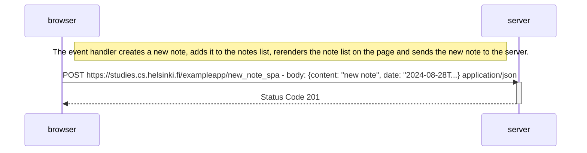

## Diagram for new note in SPA

```mermaid
sequenceDiagram
    participant browser
    participant server

        Note right of browser: The event handler creates a new note, adds it to the notes list, rerenders the note list on the page and sends the new note to the server.

    browser->>server: POST https://studies.cs.helsinki.fi/exampleapp/new_note_spa - body: {content: "new note", date: "2024-08-28T...} application/json
    activate server
    server-->>browser: Status Code 201
    deactivate server
```